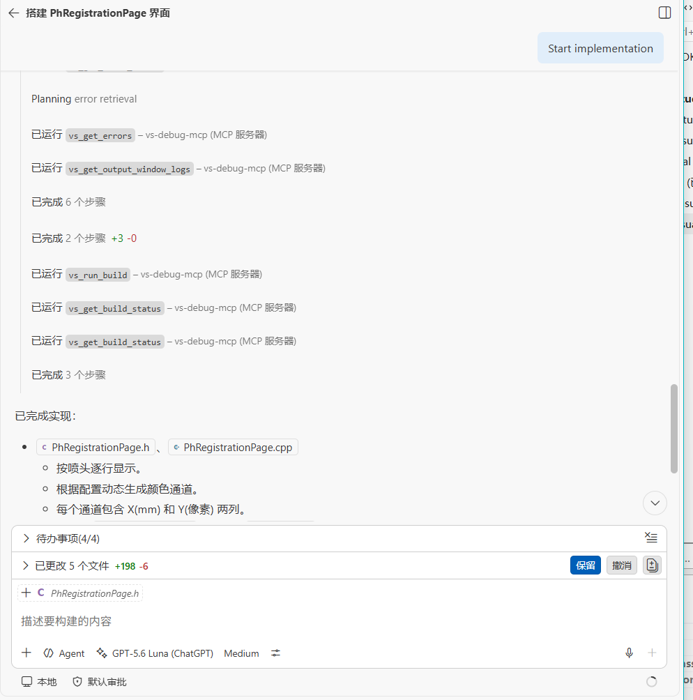

# VsDebugMcp

Visual Studio 2026 / VS 18.x MCP integration using a shared out-of-process Host and an in-process VSIX Bridge.

## Architecture

```text
VS Code / MCP client
	-> Streamable HTTP at http://127.0.0.1:43260
	-> one shared VsDebugMcp.Host per Windows user
	-> vsInstanceId registry and router
	-> per-instance current-user Named Pipe RPC
	-> Visual Studio VSIX Bridge
```

The VSIX packages a `win-x64` Framework-Dependent Host (reusing Visual Studio 2026's bundled .NET 8 runtime or system .NET 8) and ensures that it is running when Visual Studio loads. MCP clients do not launch the Host or need its installation path.

Each Visual Studio process registers a session identity derived from its PID and process start time. Tools may omit `vsInstanceId` when one instance is registered; when multiple instances are registered, callers must select one explicitly.

## Current capabilities

### Solution, Project & Build Context
- `vs_health` — MCP server and Visual Studio bridge connectivity check
- `vs_capabilities` — Active IDE capability discovery
- `vs_list_instances` / `vs_find_instances` — Multi-instance Visual Studio management
- `vs_get_projects_in_solution` — Solution structure and project discovery
- `vs_get_files_in_project` — Comprehensive project source file tree and C++ filters
- `vs_run_build` — Asynchronous IDE build execution
- `vs_get_build_status` — Build task state polling
- `vs_cancel_build` — Active build cancellation
- `vs_get_errors` — Error list diagnostics extraction
- `vs_get_output_window_logs` — Raw Build Output and IDE pane logs

### Debugger Launch, Control & Diagnostics
- `vs_debugger_start` — Programmatic F5 launch with smart landing break detection
- `vs_debugger_get_info` — Debugger mode, active process, thread, and break reason
- `vs_debugger_set_breakpoints` — Source line breakpoint management
- `vs_debugger_get_call_stack` — Call stack capture upon pause/breakpoint
- `vs_debugger_get_locals` — Arguments and local variables inspection
- `vs_debugger_evaluate_expr` — Single expression evaluation with timeout protection
- `vs_debugger_evaluate_expressions` — Single-RPC batch expressions evaluation
- `vs_debugger_step_over` / `step_into` / `step_out` — Stepping execution control
- `vs_debugger_continue` / `pause` / `stop` — Session continuation, pause, and termination

### In action



## Projects

- `src/VsDebugMcp.Protocol` — shared IPC contracts, framing, instance identity and error model; targets `net8.0` and `netstandard2.0`.
- `src/VsDebugMcp.Host` — framework-dependent .NET 8 Streamable HTTP MCP Host, instance registry and Named Pipe Bridge client.
- `src/VsDebugMcp.Vsix` — SDK-style VSSDK Bridge, Host launcher and Visual Studio instance registrar.

## VS Code configuration

```json
{
	"servers": {
		"vs-debug-mcp": {
			"type": "http",
			"url": "http://127.0.0.1:43260"
		}
	},
	"inputs": []
}
```

The Host listens only on IPv4 loopback. If port `43260` is occupied, startup fails safely and does not select another port or terminate the occupying process.

## Lifecycle

- A loaded VSIX probes the current-user Host control pipe.
- If no compatible Host is running, the VSIX starts the packaged Host.
- Every Visual Studio instance has an independent Bridge pipe.
- The VSIX sends a heartbeat every 5 seconds.
- The Host removes an instance after 15 seconds without a heartbeat.
- The Host exits immediately after the final registered instance is removed.

## Build

Use the VS Code tasks:

- `build: managed`
- `build: vsix`
- `build: vsix: release`
- `build: all`
- `deploy: vsix`

The VSIX project must be built with the Visual Studio 18 MSBuild installation. Its build publishes the Host as `win-x64` framework-dependent and embeds it under `Host/` in the VSIX package.

Ordinary builds do not deploy the extension. Deployment requires closing the relevant Visual Studio instance and running `deploy: vsix` explicitly.

## Validation status

The fixed HTTP/shared Host source builds successfully, and the generated VSIX contains the framework-dependent Host. Live acceptance still requires deploying the VSIX, restarting the intended Visual Studio instance and validating the complete MCP client → HTTP Host → instance router → Named Pipe → VSIX → Visual Studio path.

## Security and privacy

- MCP HTTP is bound only to `127.0.0.1:43260`.
- Host control and Bridge pipes are restricted to the current Windows user.
- Remote access is not supported.
- The Host does not terminate unknown processes during port conflicts.
- Logs must not include request payloads, credentials, environment variables or raw Visual Studio Copilot logs.

The project targets `vs2026_5`. The VSIX currently pins `Microsoft.VisualStudio.Sdk` to `17.14.40265` while building with Visual Studio 18 MSBuild.

## Release notes

See [CHANGELOG.md](CHANGELOG.md) for detailed version history and release notes.
