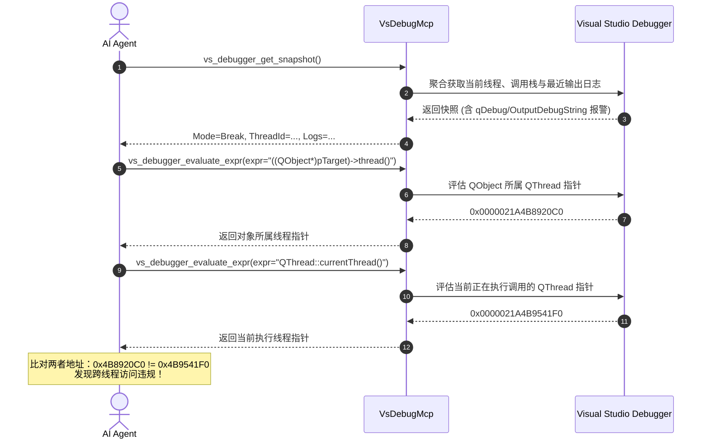

# Qt 与工控协议诊断最佳实践指南 (Qt & PLC Protocol Debugging Guide)

> **适用版本**: VsDebugMcp v0.1.19.0+  
> **核心工具**: `vs_debugger_get_snapshot`, `vs_debugger_evaluate_expr`, `vs_debugger_read_memory`

---

## 1. 架构理念：通用原语 vs 领域偏见

在设计 LLM Agent 协同调试能力时，若将特定领域逻辑（如 Qt 的 `QObject*` 强制类型转换、PLC 的专用 CRC 校验函数）强行固化到 C# VSIX 桥接插件内部，会导致：
1. **符号耦合与脆弱性**：C++ 模板、内联函数、宏定义（如 `QT_NAMESPACE`）在未完全加载专用 PDB 符号时会导致 COM 评估失败。
2. **协议腐化**：增加大量专用工具破坏 MCP 工具集的正交性与通用性。

**VsDebugMcp 的设计准则**：通过通用调试诊断原语（**调试快照** + **表达式求值** + **进程虚拟内存透视**），结合 **Agent 引导 Prompt**，赋予大模型自主分析复杂工业通信协议与 Qt 跨线程对象所有权的能力。

---

## 2. 场景一：Qt 跨线程所有权与 GUI 亲和性诊断

### 2.1 典型工业与桌面故障
- `QObject::killTimer: Timers cannot be stopped from another thread`
- `QObject: Cannot create children for a parent that is in a different thread`
- 界面在后台工控采集线程触发更新时偶发卡死或段错误 (`SIGSEGV`)

### 2.2 Agent 诊断标准作业程序 (SOP)



### 2.3 实用表达式诊断清单
- **目标对象所属线程**：
  ```cpp
  ((QObject*)this)->thread()
  // 或派生类指针
  ((QObject*)m_pWorker)->thread()
  ```
- **当前执行线程**：
  ```cpp
  QThread::currentThread()
  ```
- **GUI 主线程指针**：
  ```cpp
  QCoreApplication::instance()->thread()
  ```
- **解决方案建议**：
  若对象所有权与调用线程不一致，Agent 建议用户使用：
  `QMetaObject::invokeMethod(pTarget, "slotName", Qt::QueuedConnection);`
  或将工作对象迁移至目标线程：
  `pWorker->moveToThread(pTargetThread);`

---

## 3. 场景二：工控 PLC / Modbus 协议通信报文内存逆向诊断

### 3.1 典型通信问题
- Modbus RTU / TCP 报文 CRC/LRC 校验失败
- 工业以太网 (Profinet / EtherCAT / S7Comm) 封包对齐与大端字节序 (Big-Endian) 解析错位
- 缓冲区越界与动态环形缓冲区 (RingBuffer) 覆盖

### 3.2 Agent 诊断标准作业程序 (SOP)

1. **设置断点**：在串口/Socket 数据接收回调或解包函数入口设置断点：
   ```json
   {
     "filePath": "C:\\Project\\ModbusClient.cpp",
     "line": 142
   }
   ```
2. **捕获快照**：触发断点后调用 `vs_debugger_get_snapshot`，一次性获取当前堆栈及局部指针变量（如 `rxBuffer`、`rxLength`）。
3. **精准内存透视**：调用 `vs_debugger_read_memory` 读取底层字节流：
   ```json
   {
     "address": "rxBuffer",
     "byteCount": 32
   }
   ```
4. **报文解析分析**：
   - 工具直接输出易读的 16 进制转储与 ASCII 侧边栏：
     ```text
     7FFE354A0000  01 03 00 00 00 02 C4 0B  00 00 00 00 00 00 00 00  |........|
     ```
   - **Modbus 帧结构对照**：
     - `01`: 从机地址 (Slave Address)
     - `03`: 功能码 (Read Holding Registers)
     - `00 00`: 起始寄存器地址 (Register 40001)
     - `00 02`: 读取寄存器数量 (2 个寄存器，4 字节)
     - `C4 0B`: CRC16 校验码 (低字节在前，高字节在后)

### 3.3 内存读取核心特性
- **指针表达式自动解析**：直接支持变量名表达式（如 `pBuffer`、`&data[0]`、`this->m_buffer`），无需人工计算绝对虚拟地址。
- **抗崩溃防护**：通过 Win32 `ReadProcessMemory` 在被挂起的目标进程安全读取，越界或无效地址安全返回 `memory_read_failed` 错误，不会导致 Visual Studio 或调试目标异常崩溃。
- **全格式多维返回**：同时提供 `hexBytes`（空格分隔便于正则）、`hexDump`（人类与 LLM 友好型排版）、`asciiRepresentation` 以及 `base64Data`（便于二进制传输）。
